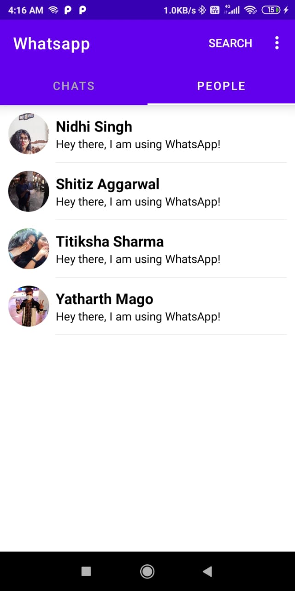
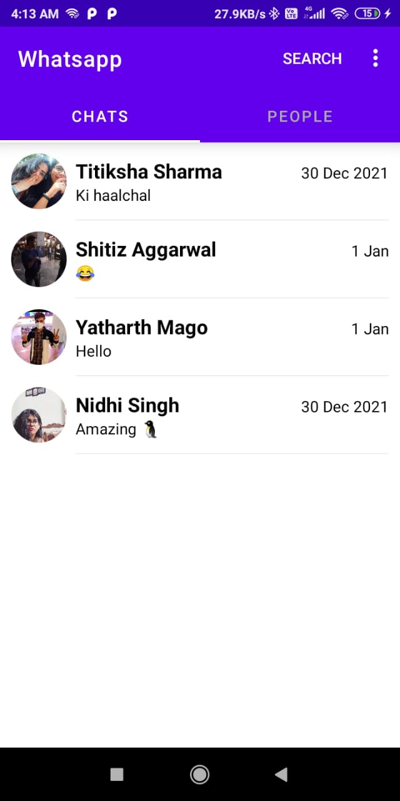
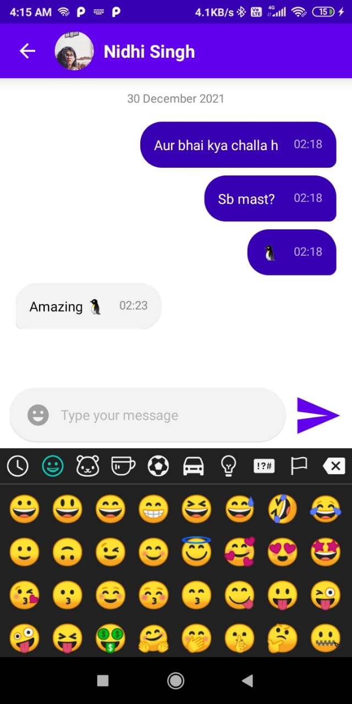

### WhatsAppClone
A chatting app similar to WhatsApp made using Firebase

#### _App Screenshots_

|  |  |  |  |
|---|---|---|---|

#### _Libraries/Technology used_
- Firebase Auth/Database/Storage, Firestore
- Firebase UI for Realtime Database and Firestore
- Picasso
- Pagination
- Recycler View
- For emojis [https://github.com/vanniktech/Emoji](https://github.com/vanniktech/Emoji "Open Git Repo")
